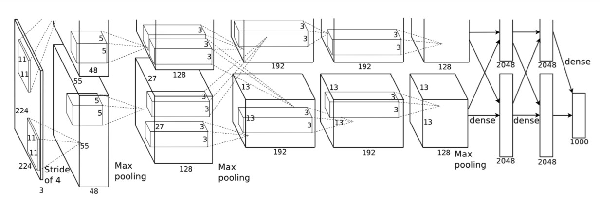

# AlexNet

> 上图中的输入是224×224，不过经过计算(224−11)/4=54.75并不是论文中的55×55，而使用227×227作为输入，则(227−11)/4=55

## 网络结构

网络包含8个带权重的层；前5层是卷积层，剩下的3层是全连接层。最后一层全连接层的输出是1000维softmax的输入，softmax会产生1000类标签的分布网络包含8个带权重的层；前5层是卷积层，剩下的3层是全连接层。最后一层全连接层的输出是1000维softmax的输入，softmax会产生1000类标签的分布。

- **卷积层C1**
  该层的处理流程是： 卷积-->ReLU-->池化-->归一化。
  - 卷积，输入是227×227，使用96个11×11×3的卷积核，得到的FeatureMap为55×55×96。
  - ReLU，将卷积层输出的FeatureMap输入到ReLU函数中。
  - 池化，使用3×33×3步长为2的池化单元（重叠池化，步长小于池化单元的宽度），输出为27×27×96（(55−3)/2+1=27)
  - 局部响应归一化，使用k=2,n=5,α=10−4,β=0.75进行局部归一化，输出的仍然为27×27×96，输出分为两组，每组的大小为27×27×48
- **卷积层C2**
  该层的处理流程是：卷积-->ReLU-->池化-->归一化
  - 卷积，输入是2组27×27×4827×27×48。使用2组，每组128个尺寸为5×5×485×5×48的卷积核，并作了边缘填充padding=2，卷积的步长为1. 则输出的FeatureMap为2组，每组的大小为27×27 times12827×27 times128. （(27+2∗2−5)/1+1=27(27+2∗2−5)/1+1=27）
  - ReLU，将卷积层输出的FeatureMap输入到ReLU函数中
  - 池化运算的尺寸为3×33×3，步长为2，池化后图像的尺寸为(27−3)/2+1=13(27−3)/2+1=13，输出为13×13×25613×13×256
  - 局部响应归一化，使用k=2,n=5,α=10−4,β=0.75k=2,n=5,α=10−4,β=0.75进行局部归一化，输出的仍然为13×13×25613×13×256，输出分为2组，每组的大小为13×13×12813×13×128
- **卷积层C3**
  该层的处理流程是： 卷积-->ReLU
  - 卷积，输入是13×13×25613×13×256，使用2组共384尺寸为3×3×2563×3×256的卷积核，做了边缘填充padding=1，卷积的步长为1.则输出的FeatureMap为13×13 times38413×13 times384
  - ReLU，将卷积层输出的FeatureMap输入到ReLU函数中
- **卷积层C4**
  该层的处理流程是： 卷积-->ReLU
  该层和C3类似。
  - 卷积，输入是13×13×384，分为两组，每组为13×13×192.使用2组，每组192个尺寸为3×3×192的卷积核，做了边缘填充padding=1，卷积的步长为1.则输出的FeatureMap为13×13 ×384，分为两组，每组为13×13×192
  - ReLU，将卷积层输出的 FeatureMap 输入到 ReLU 函数中
- **卷积层C5**
  该层处理流程为：卷积-->ReLU-->池化
  - 卷积，输入为13×13×38413×13×384，分为两组，每组为13×13×19213×13×192。使用2组，每组为128尺寸为3×3×1923×3×192的卷积核，做了边缘填充padding=1，卷积的步长为1.则输出的FeatureMap为13×13×25613×13×256
  - ReLU，将卷积层输出的FeatureMap输入到ReLU函数中
  - 池化，池化运算的尺寸为3×3，步长为2，池化后图像的尺寸为 (13−3)/2+1=6(13−3)/2+1=6,即池化后的输出为6×6×2566×6×256
- **全连接层FC6**
  该层的流程为：（卷积）全连接 -->ReLU -->Dropout
  - 卷积->全连接： 输入为6×6×256该层有4096个卷积核，每个卷积核的大小为6×6×256。由于卷积核的尺寸刚好与待处理特征图（输入）的尺寸相同，即卷积核中的每个系数只与特征图（输入）尺寸的一个像素值相乘，一一对应，因此，该层被称为全连接层。由于卷积核与特征图的尺寸相同，卷积运算后只有一个值，因此，卷积后的像素层尺寸为4096×1×1，即有4096个神经元。
  - ReLU,这4096个运算结果通过ReLU激活函数生成4096个值
  - Dropout,抑制过拟合，随机的断开某些神经元的连接或者是不激活某些神经元
- **全连接层FC7**
  流程为：全连接-->ReLU-->Dropout
  - 全连接，输入为4096的向量
  - ReLU,这4096个运算结果通过ReLU激活函数生成4096个值
  - Dropout,抑制过拟合，随机的断开某些神经元的连接或者是不激活某些神经元
- **输出层**
  第七层输出的4096个数据与第八层的1000个神经元进行全连接，经过训练后输出1000个float型的值，这就是预测结果。

### AlexNet参数数量

## 更深的网络结构

使用层叠的卷积层，即卷积层+卷积层+池化层来提取图像的特征

## 防止过拟合的方法
神经网络的一个比较严重的问题就是过拟合问题，论文中采用的数据扩充和Dropout的方法处理过拟合问题。

### 1. Data Augmentation [[8 - 数据增强、梯度下降]]
(数据扩张，就是对原始数据做一些变化)
数据扩充是防止过拟合的最简单的方法，只需要对原始的数据进行合适的变换，就会得到更多有差异的数据集，防止过拟合。

### 2. Dropout 
[DropOut](DropOut.md)

Dropout背后有很多有意思的东西，但是在这里我们不需要了解太深，只需要知道Dropout是在全连接层中去掉了一些神经节点，达到防止过拟合的目的，我们可以看上面的图在第六层和第七层都设置了Dropout。

## 使用ReLU替换之前的sigmoid

## 多GPU训练

## LRN（临近数据的归一化）

https://blog.csdn.net/qq_27825451/article/details/88745034

## overlapping Pooling。其实就是带有stride移动（非默认）的pooling