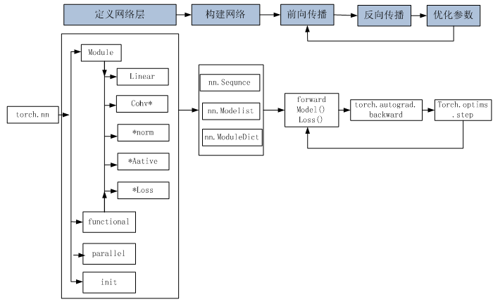

# Pytorch 实现神经网络


1. **model**

     层：神经网络的基本结构，

     模型model：层构成的网络

     定义网络 - 输入-（卷积、池化、激活、FC、BN等）-输出

2. **dataset** 类

     - dataset 定义 数据集
       - dataloader 数据加载
       - 对数据进行预处理使用的 transformer

     ```python
     transformer.Cpmpose() 串起来
     normalize 对张量进行归一化
     ```

3. **predict**

     训练模型时需要注意使模型处于训练模式，即调用 model.train()。调用 model.train() 会把所有的 module 设置为训练模式。如果是测试或验证阶段，需要使模型处于验证阶段，即调用 model.eval()。调用 model.eval()会把所有的training属性设置为 False。

4. **train** 

  - **optimizer** （SGD、BGD、Adam）momentum

    缺省情况下梯度是累加的，需要手工把梯度初始化或清零，调用optimizer.zero_grad()即可。训练过程中，正向传播生成网络的输出，计算输出和实际值之间的损失值。 调用loss.backward()自动生成梯度，然后使用optimizer.step（）执行优化器，把梯度传播回每个网络。

  - **loss function** （直接用损失函数进行backward）

  - lr 学习率 

    动态修改学习率参数
    
    ```python
    len(optimizer.param_groups[0])#结果为6
    
    for epoch in range(num_epoches):
        #动态修改参数学习率
        if epoch%5==0:
            optimizer.param_groups[0]['lr']*=0.1
            print(optimizer.param_groups[0]['lr'])
        for img, label in train_loader:
           ######
    ```

    

  - init （参数初始化的方法）

  - epoch、batchsize 

  如果希望用GPU训练，需要把模型、训练数据、测试数据发送到GPU上，即调用.to(device)。如果需要使用多GPU进行处理，可使模型或相关数据引用nn.DataParallel。nn.DataParallel的具体使用在第4章将详细介绍。

```python
y_hat = net(X)
l = loss(y_hat, y)
optimizer.zero_grad()
l.backward()
optimizer.step()
```

训练

```python
# 本函数已保存在d2lzh_pytorch包中方便以后使用
def train_ch5(net, train_iter, test_iter, batch_size, optimizer, device, num_epochs):
    net = net.to(device)
    print("training on ", device)
    loss = torch.nn.CrossEntropyLoss()
    for epoch in range(num_epochs):
        train_l_sum, train_acc_sum, n, batch_count, start = 0.0, 0.0, 0, 0, time.time()
        for X, y in train_iter:
            X = X.to(device)
            y = y.to(device)
            y_hat = net(X)
            l = loss(y_hat, y)
            optimizer.zero_grad()
            l.backward()
            optimizer.step()
            train_l_sum += l.cpu().item()
            train_acc_sum += (y_hat.argmax(dim=1) == y).sum().cpu().item()
            n += y.shape[0]
            batch_count += 1
        test_acc = evaluate_accuracy(test_iter, net)
        print('epoch %d, loss %.4f, train acc %.3f, test acc %.3f, time %.1f sec'
              % (epoch + 1, train_l_sum / batch_count, train_acc_sum / n, test_acc, time.time() - start))

```


---

http://www.feiguyunai.com/index.php/2019/09/11/pytorch-char03/