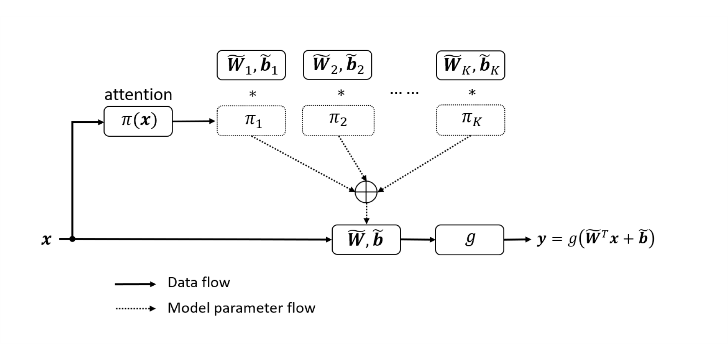
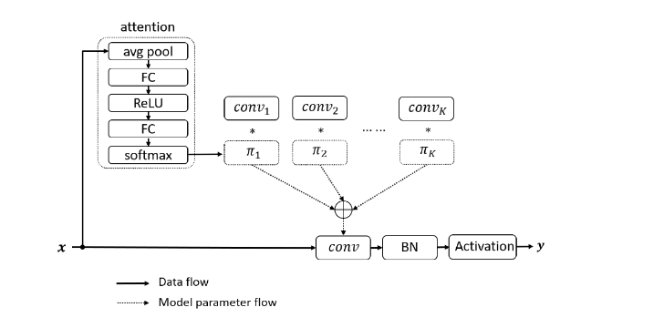
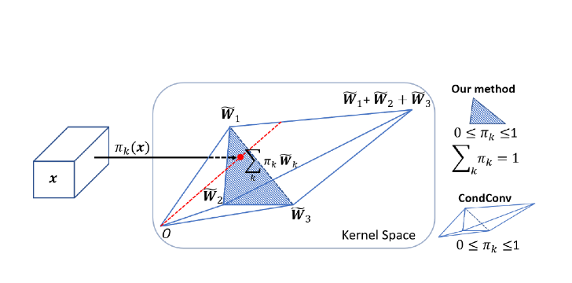

[Code](https://github.com/kaijieshi7/Dynamic-convolution-Pytorch) 

[代码解释](https://zhuanlan.zhihu.com/p/208519425)

---

自适应卷积的目的是使得像素的激活点不集中与其周围，而是更广大的范围，也就是说尽可能的直接看到关键点；自适应卷积回归的是该像素与关键点的x/y偏移量，这也是直接让模型的自始至终对关键点建模的一种操作。

# Motivation
轻量级的网络由于深度(卷积层数)和宽度(通道数)的限制导致性能下降。为了解决这个问题提出这种可以不增加深度或者宽度的模型。这种模型是基于注意力机制的动态卷积。

# Contribution

提出了一种动态卷积，它在同一层使用K个并行的卷积 $\{\tilde{W_k},\tilde{b_k}\}$, 输入x经过attention产生一组权重（和等于1），每个权重对应相应的并行的卷积操作，然后由下式聚合：

这组权重通过  SE 模块(squeeze and excitation)来计算。先将输入特征在通道上进行平均池化，变为HxWxCin大小，之后经过两层全连接层（中间包括一个relu层），第1个全连接层将大小变为原来的1/4，FC2将输出长度为k的值，由softmax获取权重。

不同于SE将权重加在通道上，论文将权重加在并行的卷积上。

注意模块多出的计算量 $Atten = (H*W*Cin) + (Cin*Cin/4) + (Cin/4 * k)$，聚合操作多出的计算量$K = (k*Cin*Cout*Dk*Dk) + (k*Cout)$，都远小于卷积的计算量：$H*W*Cin*Cout*Dk*Dk$（Dk是卷积核的大小）。

动态卷积网络的难点在于多个卷积核和注意力模型的共同学习。这个困难会随着网络深度的增加而增加。本文提出，解决这个问题有两个关键点。

1. 限制注意力取值 简化注意力模型学习

   限制注意力的取值将简化注意力模型的学习。注意力取值的限制将缩小多个卷积的叠加核的取值空间。文中将注意力取值限制在0与1之间，同时所有注意力的和为1。

   如图3所示，如果使用3个卷积核，注意力在0与1之间把叠加核限制在两个三棱锥中，注意力的和为1把叠加核进一步限制在以这三个卷积核为顶点的三角形中。对于这两个限制，softmax 是一个很自然的选择。使用3个卷积核W1W2W3（可以看成是空间坐标中的3个向量），将注意力取值限制在0与1之间会将叠加核的取值限制在整个三棱锥中，而限制其和为1将进一步将叠加核的取值限制在图中的三角形中。因此，选择softmax比选择sigmoid更好。

2. 限制注意力接近均匀分布有利于多个卷积核在训练初期同时学习

   softmax的注意力比较稀疏。因此论文提出了一个temperature参数，在第2个全连接层和softmax之间让输出除以t，以实现更均匀的注意结果：

---

**Refer**

[动态滤波器卷积｜DynamicConv](https://zhuanlan.zhihu.com/p/208519425)

[Dynamic Convolution: Attention over Convolution Kernels](https://blog.csdn.net/qq_35756383/article/details/115209667)