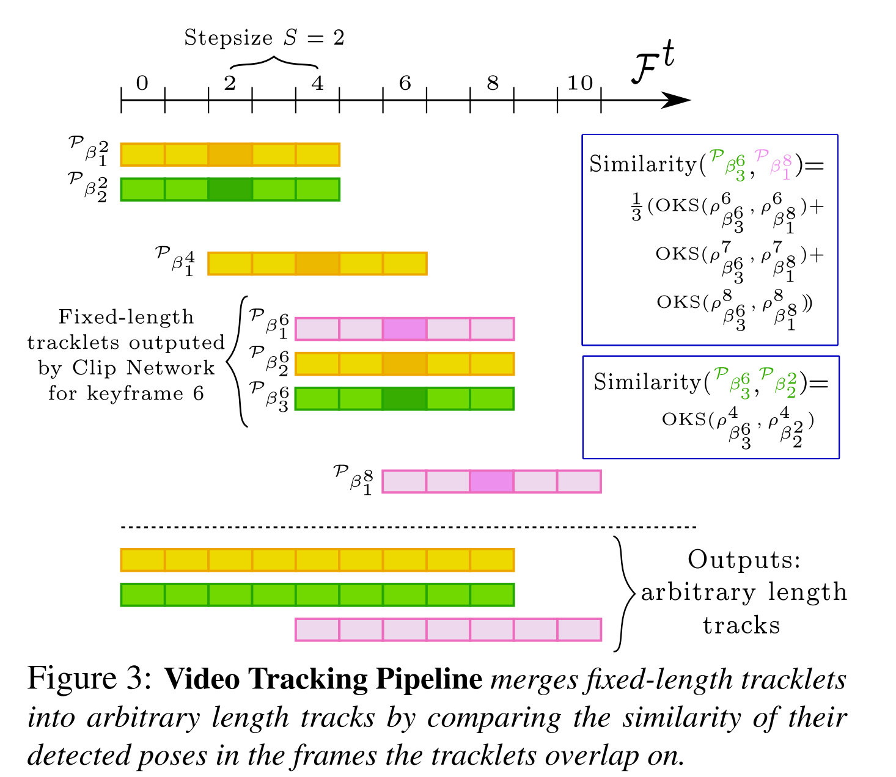

# Combining detection and tracking for human pose estimation in videos

---
#paper

# Summary

遵循Top-down方法的框架

# Contribution

1. 片段跟踪网络，它对小视频片段同时进行人体关节检测和跟踪；
2. 视频跟踪管道，其将由剪辑跟踪网络产生的固定长度的轨道合并到任意长度的轨道；
3. 基于空间和时间平滑项来细化联合位置的空间时间合并过程。
4. 聚类，我们在时空融合过程中使用聚类，对所有的联合假设进行聚类，并在聚类上求解一个时空优化问题，来估计每个关节的最佳位置）

tube创建：

