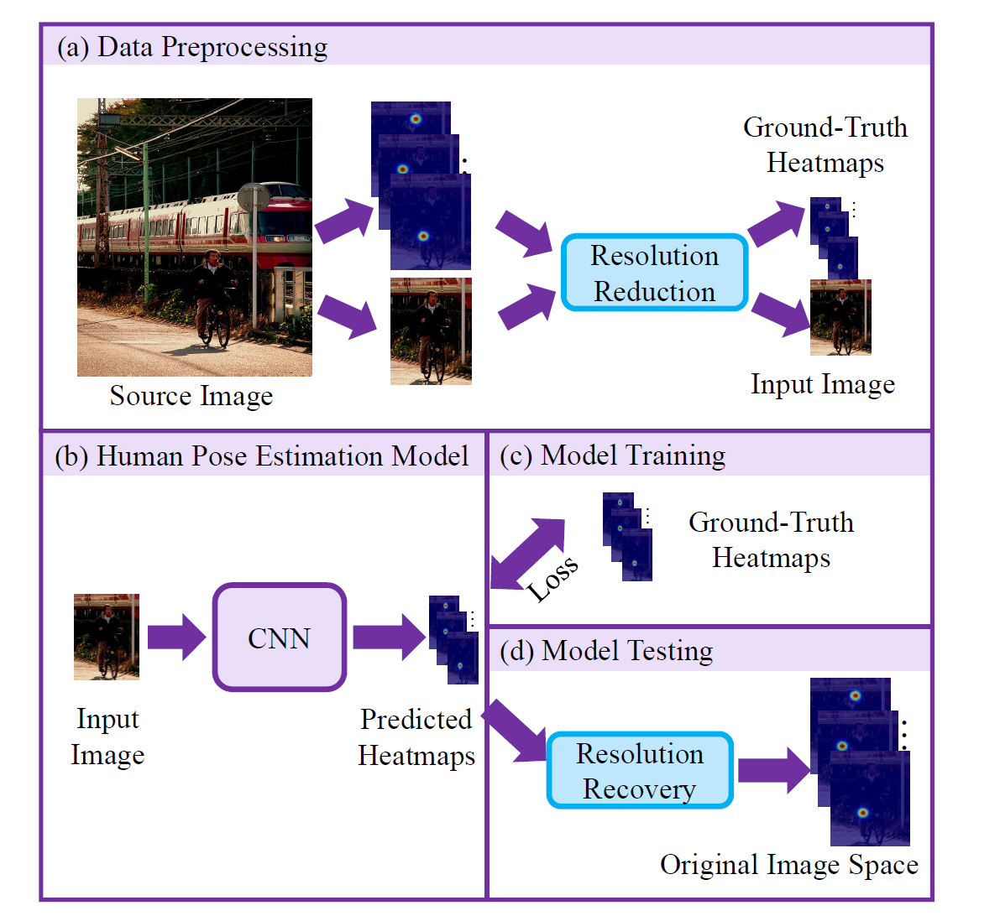

# Distribution-Aware Coordinate Representation for Human Pose Estimation
---
#DL/heatmap  #paper [代码](https://github.com/ilovepose/DarkPose)
# Summary
减少 Heatmap 编码解码的误差

# Motivation
在传统方法中，编码时我们将heatmap作为一种高斯概率分布，解码时却只利用了最大值信息。DARK-Pose认为模型预测出的heatmap应与ground truth有一致性，即假设预测出的heatmap也是一个高斯分布，我们应该利用整个分布的信息来进行keypoint的精确位置预测。

# Contribution

进一步探讨了现有方法中广泛使用的标准坐标译码方法的设计局限性，
（1）提出了一种更有原则的分布式感知译码方法，基于泰勒展开的高效坐标解码，
（2）我们通过为无偏模型训练生成精确的热图分布来改进标准坐标编码过程

把这两个创新点结合起来，formulate了一种新的基于分布感知的关键点坐标表示方法（Distribution-Aware Coordinate Representation for Human Pose Estimation）(DARK) 。

---
## 解码

模型训练理想情况，网络预测的heatmap会与GT 的 label 同高斯分布。
利用Log-likehood对数似然优化原则来推测最大值

由于该点是高斯分布的极值，极值处一阶导为0

.png)

在该点处使用二阶泰勒展开，其中m是预测最大值

.png)
最终得到想要预测的关键点坐标。
上述推导是基于预测的heatmap是一个理想的高斯分布的情况下的，现实情况下预测的heatmap会在最大值附近出现多个峰值，这对上述的decode方法会产生负面影响，所以因此要进行heatmap的处理。文中使用高斯核对heatmap进行预处理，来平滑多个峰值。高斯核的kernel_size一般与训练时的kernel_size相同。

因此，整个解码过程如上图所示:

第一步 将预测的heatmap进行平滑(使用与编码时相同的高斯核)，消除真值附近多个峰值；
第二步 根据分布信息预测偏移(对数似然+泰勒展开)；
第三步 恢复到原图尺度。

## 编码 - 无偏编码

在产生heatmap时，直接使用浮点数产生heatmap：

---
https://blog.csdn.net/weixin_43916755/article/details/105731954