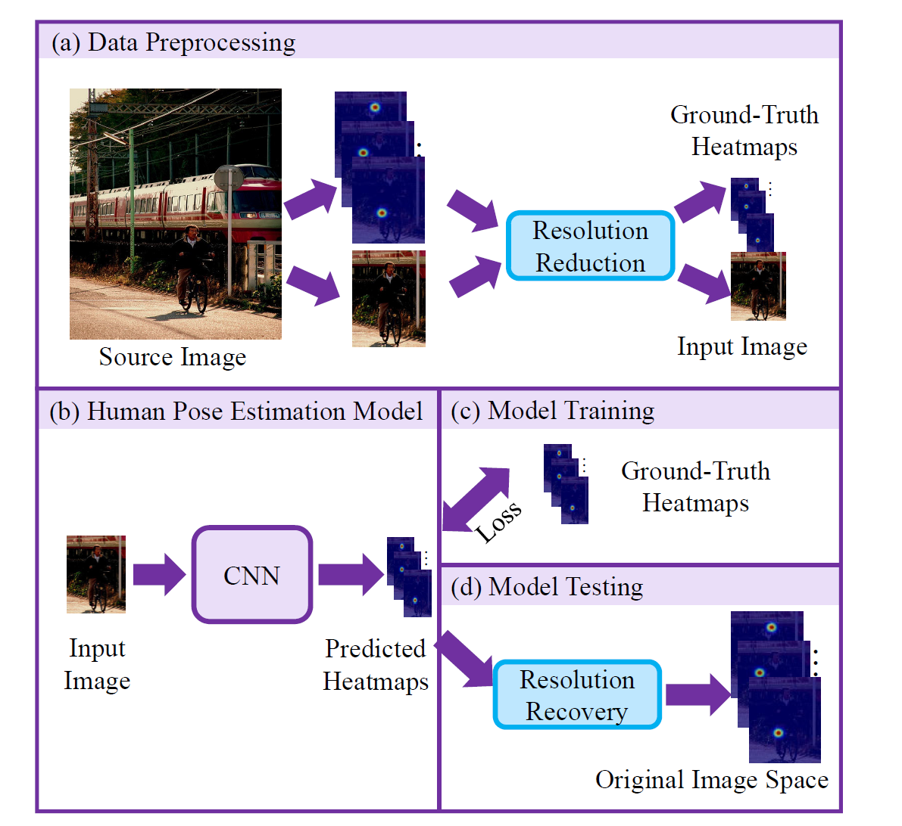
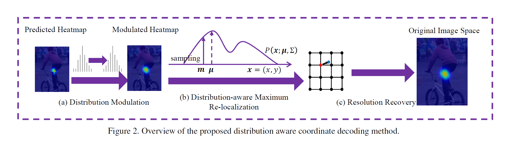

# Motivation
在传统方法中，编码时我们将heatmap作为一种高斯概率分布，解码时却只利用了最大值信息。DARK-Pose认为模型预测出的heatmap应与ground truth有一致性，即假设预测出的heatmap也是一个高斯分布，我们应该利用整个分布的信息来进行keypoint的精确位置预测。具体地，通过泰勒二阶展开，我们可以预测从最大值点到真实keypoint的偏移。具体推导见论文。

# Contribution

进一步探讨了现有方法中广泛使用的标准坐标译码方法的设计局限性，
（1）提出了一种更有原则的分布式感知译码方法，基于泰勒展开的高效坐标解码，
（2）我们通过为无偏模型训练生成精确的热图分布来改进标准坐标编码过程

把这两个创新点结合起来，formulate了一种新的基于分布感知的关键点坐标表示方法（Distribution-Aware Coordinate Representation for Human Pose Estimation）(DARK) 。

---

预测一个offset 和 heatmap

前面14个heatmap代表14个关键点的概率分布，最后一个heatmap是中心点的概率分布。
需要注意的是heatmap只负责预测概率（置信度），而坐标全由offset得到。
offset包括28个通道，偶数通道预测x坐标的偏移量，奇数通道预测y坐标的偏移量。具体来说，offset[1, 2 * i, m, n] 代表m, n位置处第i个关键点的x坐标偏移量， offset[1, 2 * i+1, m, n] 代表m, n位置处，第i个关键点的y坐标偏移量。

既然知道了offset 是坐标偏移量，但具体是怎么偏移的呢？网络上并没有找到相关的资料，只能看代码理解了。

这里引入两个概念：location_map（代码中的locations）和posemap，这两个map的shape和offset一样，都是[1, 28, h/4, w/4]。

location_map 和 posemap 以及 offset 的关系如下：

**posemap = location_map - offset**

先解释location_map，

location_map的所有的偶数通道图像都是一样的，所有的奇数通道图像也是。f(x, y)表示图像像素值，对于偶数通道的location_map, f(x, y)=x，对于奇数通道，f(x, y)=y，下面这两张图分别展示了偶数通道和奇数通道的 location_map：

将location_map和offset相减后便得到posemap，注意posemap的维度也是[1, 28, h/4, w/4]，对posemap进行4倍上采样得到[1, 28, h, w]的posemap，这个posemap就可以用来得到关键点坐标。理解posemap非常重要，我是这么理解的：把posemap看作一个w * h的28通道图像，这28个通道对应[14， 2]的坐标信息，即第一个通道代表第一个关键点的x坐标，第二个通道代表第一个关键点的y坐标，以此类推。因此在posemap的28通道图像上，每个位置28个值，代表骨骼中心点在这个位置处的14个关键点坐标信息。这时第15个通道的heatmap预测的中心点信息就用上了，比如我们在中心点的heatmap上得到（i, j）位置处的中心点概率最大，就可以用（i, j）这个坐标去posemap中索引得到14个骨骼关键点坐标。我一开始以为这个网络检测关键点的思路是通过heatmap得到所有关键点的坐标，再进行组合，实际上并不是这样的思路。

到此HigherHRnet/DEKR骨骼关键点检测的后处理大体思路也已经一目了然：
1. 先通过网络得到heatmap和offset，通过 location_map 和 offset 生成 posemap
2. 在中心点 heatmap 上，找到中心点概率最大的点集以及对应概率，这个点集中的每个点都满足条件：在其周围3X3（可变动）领域中，该点的中心点概率最大。
3. 对所有可能的中心点，在posemap中索引得到它们对应的14个关键点坐标。
4. 进行非极大值抑制（NMS），选取置信度在阈值之上的关键点作为最终结果。

其余的一些细节比如：图像尺寸和关键点的预处理，最终如何把关键点坐标映射回原图，以及怎么通过其余14个heatmap得到每个关键点的置信度等。这些细节都就去看代码理解吧。

## 编码
## 解码

整个解码过程如上图所示，其中第一步就是将预测出的heatmap进行平滑(使用与编码时相同的高斯核)，消除真值附近的多个峰值；第二步是根据分布信息预测偏移；第三步是恢复到原图尺度。

---
https://blog.csdn.net/weixin_43916755/article/details/105731954