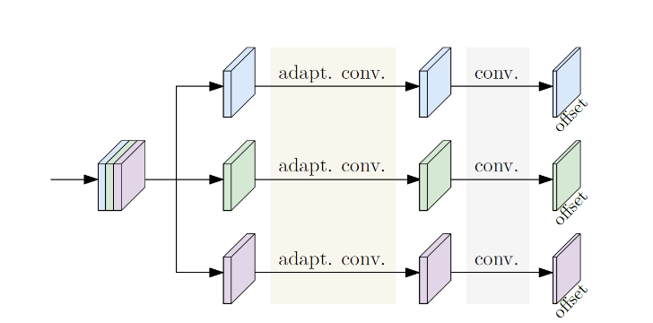

[论文](https://arxiv.org/pdf/2104.02300.pdf)      [代码](https://github.com/HRNet/DEKR)
# Bottom-Up Human Pose Estimation Via Disentangled Keypoint Regression
---
#paper
# Summary
解耦多分支关键点训练 + 自适应卷积

# Motivation

多人姿态检测任务不仅要定位不同类型的关键点，还得确定哪些关键点属于同一个人。目前的解决方案大致分为自顶向下(Top-Down)和自底向上(Bottom-Up)两类，前者先检测出包含人的目标框，再基于框内的人体进行关键点检测，类似于目标检测中的2-stage算法，先定位出一个大致的候选，再精准回归。这种做法通常更准，但同时开销也更大；后者则是通常先用热度图(heatmap)预测出关键点位置，然后再对它们进行组合，类似于目标检测的1-stage算法，效率高，但后处理可能比较繁琐。

单阶段CenterNet网络，简洁但是准确度不够好。

所以选用自底向上+密集关键点回归。

# Contribution
#DL/adaptiveConv 
- DEKR设计了一种自适应卷积，它能够使得像素点的激活范围不再局限于其邻域，而是集中在关键点周围。
- DEKR采用了多分支结构，每个分支与每个关键点一一对应，利用自适应卷积专心学习关键点特征，然后基于这些特征去回归关键点的位置。




## 解耦关键点回归

多分支结构如上图，首先将backbone输出的特征按通道划分为K份，每份送入一个独立的分支，对各关键点进行解耦。其中，每个分支都会用自适应卷积去学习对应的关键点特征，最后基于学到的特征去回归关键点的二维偏移值向量，也就是使用卷积将通道数映射为2。
这些并行的分支结构都是一样的，但是各自有独立的参数。

## Adaptive Convolutions 自适应卷积
#DL/adaptiveConv 
普通卷积层的感受野只有中心像素 $q$ 周围的卷积层。自适应卷积与可变形卷积是一家，先对像素点生成与核大小数量对应的偏移量，得到与卷积核操作的各个像素点位置后，再进行卷积。只不过，这里生成偏移量的方式并非可变形卷积那种额外使用一个卷积来完成，而是采用仿射变换的方式，具体做法是：

1. 使用卷积特征通道数映射为 4，置换到最后 $1$ 维并拆分为 $2 × 2$，得到仿射变换矩阵 $A_q(B，H，W，2，2)$ 
2. 将$A_q$与代表$3×3$常规卷积位移的矩阵进行 $G_t$ 点乘，得到的结果最后两维是$2×9(B,H,W,2,9)$, 2对应x和y坐标，9对应着3x3位置个偏移量，合并这两维并置换回第1维$(B,18,H,W)$；
3. 使用卷积将特征通道数映射为$2(B,2,H,W)$，代表2d位移 向量t，每一维分别对应x坐标和y坐标；
4. 将$A_q G_t$ 与[tt,t,]相加得到最终 $G_q^s (B,18,H,W)$


$$
y(q) = \sum_{i=1}^9{W_i(g_{si}^q + q)}
$$
$q$ 是中心像素，$g_{si}^q$ 是 $Offset$ (可以由可变形卷积得到)  $W$是权重 

---

## Label Assignment
如果一个正样本(x,y)处于多个虚拟中心点(也就是对应多个人)的有效范围内，那么它该回归哪个人的关键点位置呢？
DEKR的做法是：选择面积最小的人去回归。至于每个人的面积，则是根据其中关键点之间的最远距离来计算。
可能有靓仔靓女们会问：为何这里不能像上述Heatmap部分那样选择最近的关键点进行回归呢？如果那样的话，一个正样本就可能回归多个人的关键点位置，而正样本是要被模型看作(学习)虚拟中心点的位置，其与人是一一对应的，也是就说，在宏观意义上，它被视作一个人。
因此，DEKR的做法，就能保证正样本回归的关键点都是属于同一个人的。
另外，由于在图像中，远近高低各人的尺度不一，因此直接回归绝对坐标的差值是不理智的，易造成模型倾向于大(尺度)人物(大尺度容易有大差值，大差值产生大loss，大大大..)。
于是，上述提到的人物面积就该“出场”(寂寞了吧)了！面积大小即尺度大小，于是可以使用面积对坐标差值进行归一化，这样就消除了尺度带来的影响。当然，由于面积是距离的二次方，因此还需要先对它开个根号。

## 多尺度特征双向融合

DEKR的成功主要得益于以上两点：解构式多分支&自适应卷积。但是，CW认为其backbone中的多尺度特征双向融合也是有一定功劳的。这里的做法继承自HRNet，低分辨率向高分辨率特征融合时，先采用1x1卷积将通道数映射为一致，然后再采用最近邻(注意不是双线性)插值一次性上采样到高分辨率大小；而高分辨率向低分辨率特征融合时，则是分段采用3x3卷积进行2倍下采样，直至达到目的低分辨率大小，并且，只在最后一个3x3卷积改变通道数。至于特征融合的方式，均是element-wise add。


#  Code

## Model

==先通过HRnet 得到 heatmap 和 offset，通过loacation_map 和 offset 生成pose_map==

**1. HRnet**
输入：[3, 512, 512]
输出：[32, 128,128]、[64, 64, 64]、[128, 32, 32]、[256, 16, 16]
拼接输出：[480, 128, 128]

**2. heatmap**
输入：[480, 128, 128]
卷积：[480, 32, 1, 1]、[32, 32，3，1]、[32, 15，1，1]
输出：heatmap [15, 128, 128]

**3. offset**
输入：[480, 128, 128]
offset_feature：conv[480, 210, 1, 1]，14个关键点（CrowdPose数据集），共14个分支，每个分支15个通道，即[15, 128, 128]。

   **3.1 自适应卷积 adapt. conv.**

   （1）仿射变换矩阵：[15, 128, 128] --conv(15,4,3,1)、reshape-->[128x128, 2, 2]

   （2）offset： 仿射变换矩阵乘以基本矩阵，然后减去基本矩阵得到位置偏移，[128x128, 2, 9]--reshape-->[18, 128, 128]

   （3）平移矩阵：[15, 128, 128] --conv(15,2,3,1)、reshape-->[2, 128, 128]

   （4）offset：将（2）中结果加上平移矩阵，相当于对结果做了一次平移变换。经过这个步骤，基本确定每个像素点相关的3x3个点坐标。[18, 128, 128]

   （5）out：[15, 128, 128]、[18, 128, 128]--DeformConv2d(15, 15, 3, 1)-->[15, 128, 128]

   （6）out：（5）中为相关像素点卷积结果，再加上原始输入[15, 128, 128]得到最终输出[15, 128, 128]。

   ```python
   class AdaptBlock(nn.Module):
       expansion = 1
   	def __init__(self, inplanes, outplanes, stride=1, 
               downsample=None, dilation=1, deformable_groups=1):
           super(AdaptBlock, self).__init__()
           regular_matrix = torch.tensor([[-1, -1, -1, 0, 0, 0, 1, 1, 1],\
                                          [-1, 0, 1, -1 ,0 ,1 ,-1, 0, 1]])
           self.register_buffer('regular_matrix', regular_matrix.float())
           self.downsample = downsample
           self.transform_matrix_conv = nn.Conv2d(inplanes, 4, 3, 1, 1, bias=True)
           self.translation_conv = nn.Conv2d(inplanes, 2, 3, 1, 1, bias=True)
           self.adapt_conv = ops.DeformConv2d(inplanes, outplanes, kernel_size=3, stride=stride,\
               padding=dilation, dilation=dilation, bias=False, groups=deformable_groups)
           self.bn = nn.BatchNorm2d(outplanes, momentum=BN_MOMENTUM)
           self.relu = nn.ReLU(inplace=True)
           def forward(self, x):
           residual = x
   
           N, _, H, W = x.shape
           transform_matrix = self.transform_matrix_conv(x)
           transform_matrix = transform_matrix.permute(0,2,3,1).reshape((N*H*W,2,2))
           offset = torch.matmul(transform_matrix, self.regular_matrix)
           offset = offset-self.regular_matrix
           offset = offset.transpose(1,2).reshape((N,H,W,18)).permute(0,3,1,2)
   		translation = self.translation_conv(x)
           offset[:,0::2,:,:] += translation[:,0:1,:,:]
           offset[:,1::2,:,:] += translation[:,1:2,:,:]
   		out = self.adapt_conv(x, offset)
           out = self.bn(out)
           
           if self.downsample is not None:
               residual = self.downsample(x)
               
   		out += residual
           out = self.relu(out)
   		return out
   ```

   **3.2 offset**

   14个分支[15, 128, 128]分别经过两次自适应卷积和Conv[15, 2, 1, 1]得到14x[2, 128, 128]，拼接之后得到[28, 128, 128]。

4. poses

	（1）将offset中取值减去各个像素的位置坐标得到posemap，[28, 128, 128]
	**posemap = location_map - offset**
	
	（2）选取heatmap中最后一维来作为人体中心点得分，heatmap[-1]（1, 128, 128），对其进行最大池化(3x3可变动)后选出取值大于阈值0.01的分数ctr_score与位置坐标，最多保留30个中心点，即最多检测出30个人。假设符合条件的有N个点，然后从posemap中选择相应的姿态[N, 14, 2]。如果一个正样本(x,y)处于多个虚拟中心点也就是对应多个人的有效范围内，那么就选择面积最小的人回归。（面积的计算方法是，根据其中关键点之间最远距离）。这是bottom-up的本质问题，如何对关键点分配聚类到某个人身上。
	
	（3）heatmap中剩余14维度为14个关键点的热力值，根据保留的中心点，用各个关键点平均值作为热力值得分heat_score。
	
	（4）最终分数为：ctr_score * heat_score
	
	（5）NMS：在同一人体关键点框内，如果两个属于不同中心点的关键点数量过近，且过近关键点的数量过多，那么仅保留heat_score最大的关键点。
---
预测一个offset 和 heatmap前面14个heatmap代表14个关键点的概率分布，最后一个heatmap是中心点的概率分布。
需要注意的是heatmap只负责预测概率（置信度），而坐标全由offset得到。
offset包括28个通道，偶数通道预测x坐标的偏移量，奇数通道预测y坐标的偏移量。具体来说，offset[1, 2 * i, m, n] 代表m, n位置处第i个关键点的x坐标偏移量， offset[1, 2 * i+1, m, n] 代表m, n位置处，第i个关键点的y坐标偏移量。
既然知道了offset 是坐标偏移量，但具体是怎么偏移的呢？网络上并没有找到相关的资料，只能看代码理解了。
这里引入两个概念：location_map（代码中的locations）和posemap，这两个map的shape和offset一样，都是[1, 28, h/4, w/4]。
location_map 和 posemap 以及 offset 的关系如下：
**posemap = location_map - offset**

先解释location_map，location_map的所有的偶数通道图像都是一样的，所有的奇数通道图像也是。f(x, y)表示图像像素值，对于偶数通道的location_map, f(x, y)=x，对于奇数通道，f(x, y)=y，下面这两张图分别展示了偶数通道和奇数通道的 location_map：
将location_map和offset相减后便得到posemap，注意posemap的维度也是[1, 28, h/4, w/4]，对posemap进行4倍上采样得到[1, 28, h, w]的posemap，这个posemap就可以用来得到关键点坐标。理解posemap非常重要，我是这么理解的：把posemap看作一个w * h的28通道图像，这28个通道对应[14， 2]的坐标信息，即第一个通道代表第一个关键点的x坐标，第二个通道代表第一个关键点的y坐标，以此类推。因此在posemap的28通道图像上，每个位置28个值，代表骨骼中心点在这个位置处的14个关键点坐标信息。这时第15个通道的heatmap预测的中心点信息就用上了，比如我们在中心点的heatmap上得到（i, j）位置处的中心点概率最大，就可以用（i, j）这个坐标去posemap中索引得到14个骨骼关键点坐标。我一开始以为这个网络检测关键点的思路是通过heatmap得到所有关键点的坐标，

---

https://blog.csdn.net/soaring_casia/article/details/119676230

[DEKR 解构式人体关键点回归（二）：标签分配(Label Assignment)](https://www.bilibili.com/read/cv12911741)
