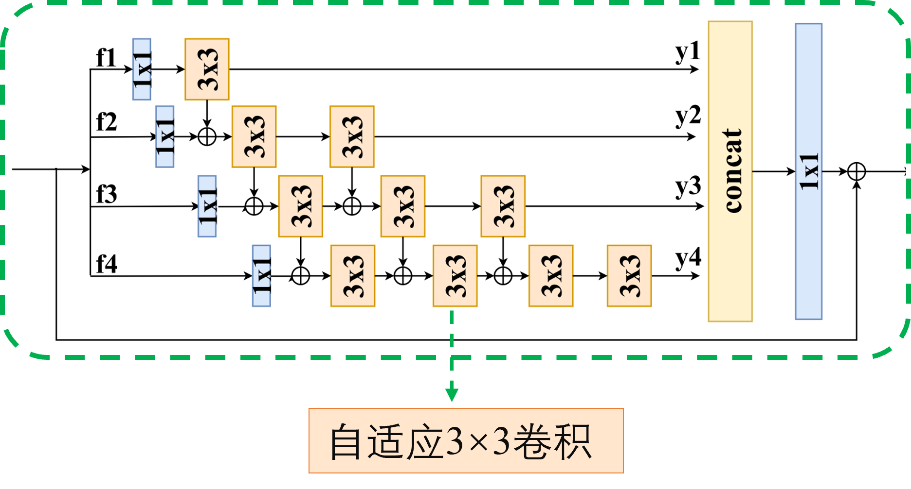
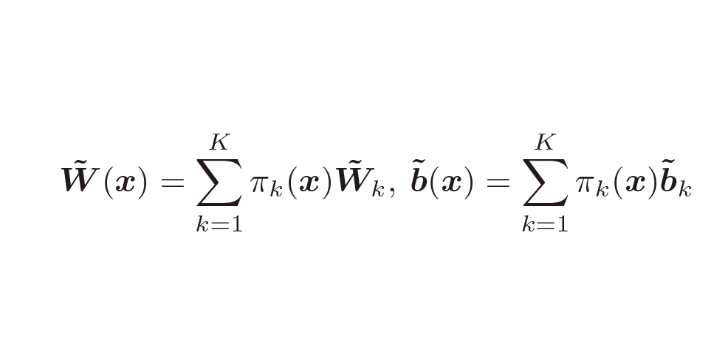
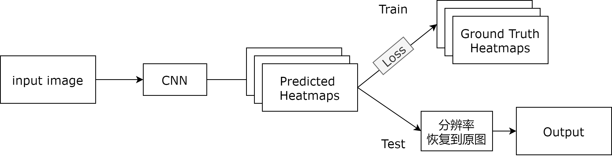
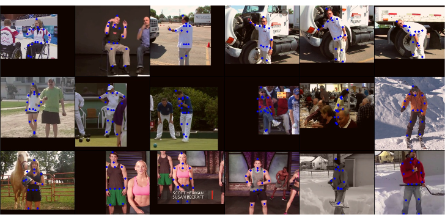

 # 1 姿态矫正模块

对于姿态进行细粒度的矫正:

1. 姿态时间合并：利用空间信息，定位关键点的搜索范围

   上图中的Pose Temporal Merger 模块，以时间分配权重，同一个人的不同关节热图衔接。

   利用神经网络对权值进行调整。对于每个关节，仅包括其自己特定时间信息的关键点热图。将15个关节点得到的热图进行拼接生成最后的热图。

   将热图输入到3 * 3的RSN残差模块中，得到合并后的热图。

2. 姿态时间残差：计算帧之间的关键点偏移。

   该部分是姿势残差融合（PRF）分支，目的是计算姿态残差，这些残差将用作时间相关的线索。这部分与PTM并行处理。

3. 姿态矫正模块：用于细化初始关键点之间的热图估计。

   不同的膨胀系数会改变有效感受野的大小。较大的膨胀系数有更大的感受野的范围。较小的膨胀系数集中在局部外观上，有助于捕获微妙的运动上下文。修改：直接将RSN block 改为自适应卷积层。
   dcpose

   

**在原文网络做的一些改变：**
  - 将RSNblock上最后的卷积改为自适应卷积取代后面的可变形卷积。
  - 原文输入为三帧图像，分别通过HRnet得到热图，调整为对于前面的帧输入已经经过该网络姿态矫正好的热图，保存调整后每一帧的热图，减少计算量。

**实验：**

  - 这个网络比较难训练，在CenterNet拼接了原文的姿态矫正模块，精度提高了1%左右。

   # 2 自适应卷积

   目前的一些工作

   1. Deformable Convolution 可变形卷积先对输入通过一个卷积得到一个offset，然后对坐标加上这个offset 进行卷积。
可变形卷积首先对输入特征图 (维度为H×W×N) 的每个位置通过标准卷积得到维度为（H × W × 2N）的偏移量图offset field，特征图的每个位置对应一个二维的偏移量 (△x,△y) ，对输入的特征图进行偏移修正，即对特征图的每个位置进行 (x, y) => (x + △x, y + △y)变换。当偏移后的位置不是整数时，用1.2.1节介绍的双线性插值的方法修正得到此位置的值，然后对修正后的特征图进行标准卷积得到最终可变形卷积结果。

   2. DY-CNN 使用注意力机制得到不同权重的自适应卷积在同一层使用K个并行的卷积$\{\tilde{W_k},\tilde{b_k}\}$  , 输入x经过attention模块这里使用的是SE attention)产生一组权重（和等于1），每个权重对应相应的并行的卷积操作。

      

   3. 使用放射变换自适应卷积主要思路：

  （1）仿射变换矩阵：[15, 128, 128] --conv(15,4,3,1)、reshape-->[128x128, 2, 2]
    
  （2）offset： 仿射变换矩阵乘以基本矩阵，然后减去基本矩阵得到位置偏移，[128x128, 2, 9]--reshape-->[18, 128, 128]
    
  （3）平移矩阵：[15, 128, 128] --conv(15,2,3,1)、reshape-->[2, 128, 128]
    
  （4）offset：将（2）中结果加上平移矩阵，相当于对结果做了一次平移变换。经过这个步骤，基本确定每个像素点相关的3x3个点坐标。[18, 128, 128]（5）out：[15, 128, 128]、[18, 128, 128]--DeformConv2d(15, 15, 3, 1)-->[15, 128, 128]
    
  （6）out：（5）中为相关像素点卷积结果，再加上原始输入[15, 128, 128]得到最终输出[15, 128, 128]。

# 3 平滑关键点Heatmap编码解码

## 3. 1 传统编码解码方式

**编码(encoding)：原始图像 --> GT heatmap**

受限于计算开销，原始图像通常需要进行下采样，再输入网络中；预测出来的heatmap中的坐标信息也需要恢复到原始图像尺度。在这个过程中，就引入了系统量化误差。

1. 下采样
   $$
   g^{’} = (u^{'},v^{'}) = \frac{g}{\lambda} = (\frac{u}{\lambda},\frac{v}{\lambda})
   $$

2. 量化
   $$
   g^{''} = (u^{''},v^{''}) = quantise(\frac{u}{\lambda},\frac{v}{\lambda})
   $$
	但一般使用$(u′,v′)$  产生heatmap时，会将坐标整数化，得到一个元素坐标，再使用高斯函数产生heatmap。这个整数的坐标和实际坐标时有一个偏差。

3. 高斯分布生成

$$
Y(x,y;g^{''}) = \frac{1}{2\pi\sigma^2}exp(-\frac{(x-u^{''})^2 + (y-v^{''})^2}{2\sigma^2})
$$

其中,$(x_k,y_k)$是Ground Truth中关键点的坐标，$\sigma$ 是高斯半径跟尺寸大小有关。

**解码(decoding)：predicted heatmap --> 原始图像中的 keypoint坐标**

1. 预测关节点的sub-pixel位置：一个常用做法是以最大值点为原点，向第二大值点偏移0.25个像素单位（0.25是人工设定的偏移量，至于为什么是0.25 可以看下文UDP-Pose中的量化分析）

$$
p = m +0.25 \frac{s-m}{||s-m||_2}
$$

2. 恢复到原图尺度
   $$
   \hat{p} = \lambda p
   $$

**椭圆高斯核编码**
$$
Y_c(x,y) = \frac{1}{2\pi\sigma^2}exp(-\frac{(x-x_k)^2}{2\sigma^2} + \frac{(y-y_k)^2}{2(\sigma \frac{H}{W})^2})
$$

## 3.2 改进的Heatmap 编码解码

**无偏编码 unbiased encodinng**
在编码过程中，不再进行量化，直接以浮点数中心点生成高斯分布。使用自适应尺度的椭圆高斯编码

**解码**
在传统方法中，编码时将heatmap作为一种高斯概率分布，解码时却只利用了最大值信息。DARK-Pose认为模型预测出的heatmap应与ground truth一致，即假设预测出的heatmap也是一个高斯分布，应该利用整个分布的信息来进行keypoint的精确位置预测。

第一步 将预测的heatmap进行平滑(使用与编码时相同的高斯核)（高斯模糊），消除真值附近多个峰值；

第二步 根据分布信息预测偏移(对数似然+泰勒展开)；
第三步 恢复到原图尺度。

这个改进和模型无关,只需要改变编码方式。
下图是一些可视化：

# 其他
1. 改进FocalLoss -> GFocalLoss

---
[目标跟踪中的（STAM）时空注意力机制 ](https://zhuanlan.zhihu.com/p/134306866)